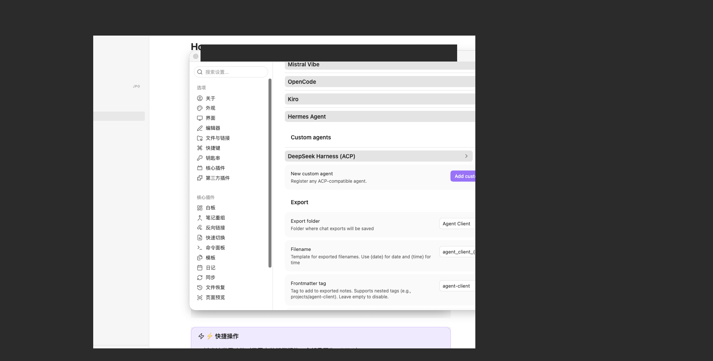
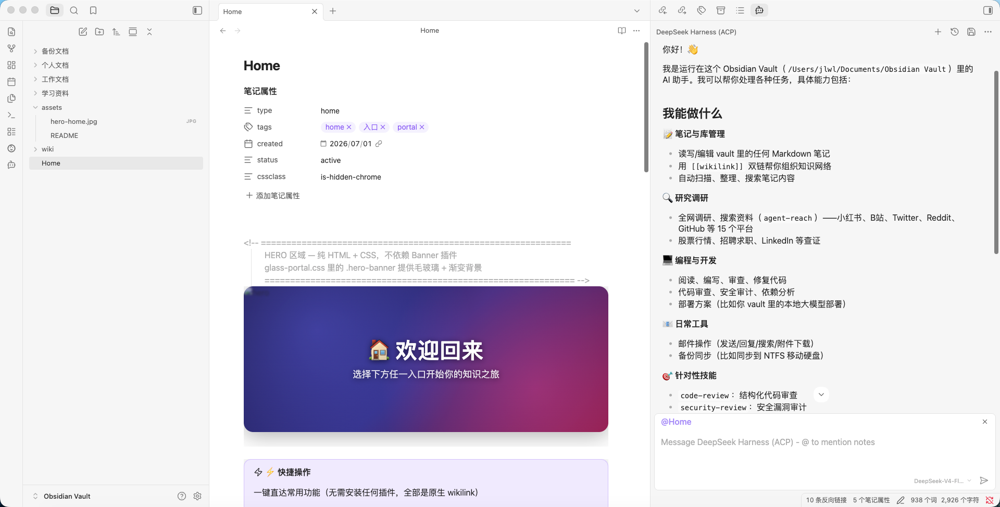
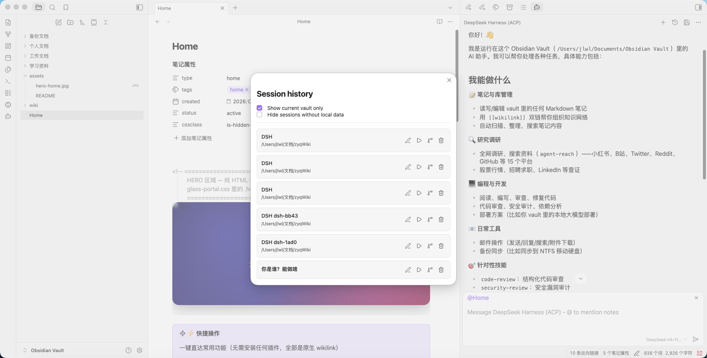

# obsidian-dsh-acp

`obsidian-dsh-acp` — это **ACP (Agent Client Protocol)**-плагин/адаптер, который
связывает **DeepSeek Harness (DSH)** с **Obsidian**. Настройте его как *Custom
Agent* в плагине **Agent Client** в Obsidian (или установите как cordis-плагин
в профиль DSH) — и вы сможете управлять DSH прямо из Obsidian: запускать диалоги
и задачи DeepSeek Harness, не выходя из приложения.

Это **ACP-сервер** (говорит на ACP v1 через stdin/stdout), который стоит между
Obsidian и DSH:

```text
Obsidian (плагин Agent Client)
      │  ① запускается как Custom Agent по протоколу ACP
      ▼
obsidian-dsh-acp (ACP-сервер)
      │  ② один промпт на ход
      ▼
dsh --profile headless "<prompt>"   (одноразовая задача DeepSeek Harness)
```

Он повторяет подход `claude-agent-acp` к обёртке Claude Code. Каждый ход (prompt turn):
- запускает свежий `dsh --profile headless "<prompt>"` (одноразовую задачу);
- потоково возвращает вывод DSH как обновления `agent_message_chunk`;
- по завершении возвращает результат `end_turn`.

Также поддерживается управление сессиями: постоянный список сессий (чтобы
«Session history» в Obsidian могла перезагружать реальные сессии), ветвление
сессий `session/fork` и зеркалирование каждого хода в архив DSH.

Репозиторий содержит две дополняющие друг друга части:

1. **`dsh-acp.mjs`** — автономный бинарник ACP-сервера (`bin: dsh-acp`).
   GUI ACP-клиенты (Obsidian Agent Client) запускают его напрямую как дочерний процесс.
2. **`index.mjs`** — [cordis][cordis]-плагин, который регистрирует сервис
   `dsh.acp` и управляет процессом адаптера *внутри* harness; используется через
   `dsh plugin --profile <name> add obsidian-dsh-acp`.

## Как это работает

```text
Obsidian Agent Client ──(ACP JSON-RPC через stdin/stdout)──▶ dsh-acp ──spawn──▶ dsh --profile headless "<prompt>"
                                   ▲  session/update чанки                      │
                                   └──────────────── stdout стримится обратно ───┘
```

- ACP v1 (JSON-RPC с разделителями-переводами строк) через stdin/stdout процесса.
- Потоковое возвращение вывода DSH как обновлений `agent_message_chunk`, затем
  возвращается `result` (`stopReason: "end_turn"`).
- Учитывается `cwd`; постоянный слой сессий делает управление сессиями удобным.

## Двухрежимная архитектура (v0.2.2+ / каркас P2 long-running)

Чтобы в Obsidian получить **диалоговое окно одобрения инструментов** и
**отображение хода рассуждений / выполнения в реальном времени**, адаптер
переключается с «spawn headless-подпроцесса на каждый ход» на
**«двухрежимное распределение (dual runtime)»**:

```text
┌─────────────────────────────────────────────────────────────────┐
│  Точка входа A: dsh-acp.mjs как автономный бинарник              │
│  (запускается Obsidian Agent Client)                              │
│  · Нет cordis ctx, runtime.mode всегда = "spawn" (обратная совм.) │
│  · Идёт существующим путём v0.2.1: spawn dsh --profile headless    │
└─────────────────────────────────────────────────────────────────┘

┌─────────────────────────────────────────────────────────────────┐
│  Точка входа B: cordis-плагин index.mjs (загружается в dsh web)    │
│  · В том же процессе, что и dsh; runtime.mode по умолчанию = "long"│
│  · long-режим: in-process import lib/long-runtime.mjs              │
│  · Подписка на ctx.llm.stream() чанки → ACP sessionUpdate          │
│  · headless-профиль автоматически откатывается на spawn            │
│    (защита существующих headless-пользователей)                    │
└─────────────────────────────────────────────────────────────────┘
```

**Текущее состояние (v0.2.2 / каркас P1.0)**: long-режим уже может быть
запущен in-process cordis-плагином, но точка входа пока бросает
P1.0-placeholder — ожидается подключение `ctx.llm.stream()` (P1.5),
4-mode одобрения (P2.0) и temperature/reasoningEffort (P2.5).
Путь spawn остаётся неизменным на 100%.

**Приоритет разбора режима** (`lib/runtime-switch.mjs::resolveRuntimeMode()`):

1. `DSH_PROFILE=headless` → принудительный spawn (для headless-пользователей)
2. Явное переопределение `DSH_ACP_RUNTIME_MODE=long|spawn`
3. `DSH_IN_CORDIS=1` → long (маркер in-process cordis-плагина)
4. По умолчанию spawn (обратная совместимость автономного бинарника)

Примеры конфигурации:

```bash
# принудительный long-режим (внутри cordis-плагина)
DSH_ACP_RUNTIME_MODE=long node dsh-acp.mjs

# откат на spawn при сбое инициализации long (включено по умолчанию)
DSH_ACP_SPAWN_FALLBACK=true DSH_ACP_RUNTIME_MODE=long node dsh-acp.mjs

# 4 режима permission (по умолчанию "default" — самый безопасный)
DSH_ACP_PERMISSION_MODE=acceptEdits    # или dontAsk / bypassPermissions
DSH_ACP_PERMISSION_TIMEOUT_MS=300000   # 5 мин таймаут → reject по умолчанию
DSH_ACP_PERMISSION_EDIT_TOOLS="Edit,Write,MultiEdit,NotebookEdit"
```

## Возможности сессий

Помимо модели «один ход без состояния», `dsh-acp` добавляет постоянный слой
сессий (`archive-store.mjs`), который обеспечивает четыре вещи:

1. **Перезагрузка списка сессий** — `session/list` возвращает устойчивые сессии
   из JSON-индекса на диске (по умолчанию `~/.dsh-acp/dsh-acp-sessions.json`),
   поэтому перезагрузка «Session history» в Obsidian показывает реальные сессии
   даже после перезапуска адаптера. При инициализации адаптер объявляет
   `sessionCapabilities.list`.
2. **Ветвление (fork) сессии** — `session/fork` глубоко копирует историю
   сообщений исходной сессии в новый id сессии, фиксирует связь с родителем и
   объявляет `sessionCapabilities.fork`, так что действие «fork» клиента работает.
3. **Резервная копия каждого хода** — каждый завершённый ход (пользователь +
   ассистент) дописывается в архив событий в формате DSH:
   `<DSH_HOME>/dsh-acp-archives/<encoded-cwd>/session-<id>/session.jsonl`.
   Он хранится в `dsh-acp-archives/` (а не в `sessions/` веб-процесса), чтобы
   обычный `.jsonl` не конфликтовал со zstd-сжатыми журналами сессий основного
   процесса. Задайте `DSH_ACP_ARCHIVE_IN_MAIN=1`, чтобы помещать архив в
   `sessions/` вместо этого (только если вы запускаете архив в том же режиме
   сжатия).
4. **Окончательное удаление сессии (v0.1.4)** — `session/delete` удаляет запись
   сессии **и** дисковой каталог архива в обоих корнях
   (`<DSH_HOME>/dsh-acp-archives/` и `<DSH_HOME>/sessions/`; каталог назван по
   ключу `session-<uuid>` записи), поэтому удалённая сессия не «воскресает» при
   следующем `list`. Адаптер объявляет `sessionCapabilities.delete`.

`session/resume` и `session/load` заново открывают сохранённую сессию.

### Переключение модели сессии (v0.1.6)

Каждая сессия может нести собственную модель. Адаптер объявляет session config
option `model` (`SessionConfigSelect`) для `session/new` / `session/load` /
`session/resume`, поэтому клиенты вроде Obsidian отрисуют выпадающий список
моделей (тот же механизм, что использует claude). `session/set_config_option`
сохраняет выбранную модель в записи сессии; при следующем `prompt` адаптер
вызывает `dsh --profile headless --patch <disposable model overlay>`, так что
только этот вызов использует выбранную модель — общие настройки профиля
никогда не меняются.

Доступные модели по умолчанию берутся из headless-каталога (`DeepSeek-V4-Flash`,
`Kimi-K2.6`, `gemini-2.5-pro`, `Qwen3.8`) и могут быть переопределены через
`DSH_ACP_MODELS` (через запятую пары `id(display)`) и
`DSH_ACP_DEFAULT_MODEL`.

### Превью саммари сессии (v0.1.6)

После каждого обмена `dsh-acp` просит модель написать **однострочное саммари**
диалога (на языке диалога) и сохраняет его в записи сессии
(`summary` / `summaryAt`). `session/list` возвращает его клиенту в
`_meta.summary` / `_meta.summaryAt`, чтобы панель «Session history» могла
предпросматривать основное содержание каждого прошлого разговора. Саммари
перегенерируются после нескольких новых сообщений (с дебаунсом);
отключать генерацию саммари не требуется — она best-effort и никогда не
блокирует ответ.

### Импорт внешней ACP-сессии (v0.1.6)

Импортируйте сессию, экспортированную другим ACP-агентом (например,
claude / Obsidian Agent Client), в хранилище dsh-acp:

```sh
node dsh-acp.mjs import <session.json> [--title '..'] [--cwd /path]
# либо внутри сессии Obsidian dsh-acp отправьте команду:
#   /import /path/to/claude-session.json
```

Принимает как формат `claude-agent-acp`
(`{ sessionId, messages:[{id,role,content,timestamp}] }`), так и собственный
формат записи dsh-acp; сохраняет только ходы `user`/`assistant` и пишет их
в новую устойчивую сессию (включая архив DSH). Импортированные сессии
затем появляются в списке сессий клиента.

> **Устойчивость и конкурентность (v0.1.4)**: индекс сессий в памяти
> сохраняется с коротким дебаунсом (`DSH_ACP_PERSIST_DEBOUNCE_MS`) и сбрасывается
> перед выходом, так что всплески сообщений сливаются в несколько операций записи;
> несколько процессов адаптера, разделяющих одно хранилище, перед записью
> объединяют свои данные с диском и никогда не воскрешают удалённую запись.
> Полный журнал изменений REQ — в `docs/规范/进度.md`.

### Панель управления сессиями dsh web и Obsidian native-импорт (локально, P1b)

Помимо Obsidian-only адаптера, этот пакет также поставляет **панель
управления сессиями dsh web** (cordis web-плагин, по умолчанию
`enableWebPanel: true`) и **импорт Obsidian в один клик, пишущий
dsh-native сессии** (видимые в списке диалогов dsh слева, возобновляемые,
разделяющие инструменты/пресеты). Следует тому же plugin surface, что и
`dsh-chat-import`.

- **Панель** (`lib/client.js`, `web/session-panel.mjs`): кнопка
  `sidebar.footer.action` в боковой панели открывает выезжающую панель с
  тремя вкладками — **Sessions** (собственное хранилище `~/.dsh-acp`:
  list / export / archive / move), **DSH Native** (показывает хранилище
  сессий dsh через `sessionPersistence`) и **Obsidian Import** (обнаружение
  и импорт в один клик сессий Obsidian Agent Client).
- **DSH-native интеграция** (`web/obsidian-import.mjs`): обнаруживает файлы
  Obsidian `agent-client/sessions/*.json` в ваших хранилищах
  (`DSH_ACP_OBSIDIAN_DIRS` для переопределения) и импортирует каждую в
  **dsh native-хранилище сессий** — пишет через `sessionPersistence`
  (SessionHandle: `create(header)` → `append` → `flush` → `close`),
  синтезируя события DSH `session` (`assistant/message` несёт итоговый
  `stream`) и прикрепляя к workspace, чтобы сессия появилась в списке
  диалогов dsh и могла быть возобновлена.
- **Совместимо с dsh 0.1.5**: формат сессий V3 (`SESSION_FORMAT_VERSION = 3`),
  модель SessionHandle в `sessionPersistence`, `sp.open('read').read()` для
  маршрута чтения/предпросмотра и нормализованные снапшоты `sp.list()`.
- HTTP-маршруты под `/api-session/*`: `list`, `export`, `archive`, `move`,
  `dsh-list`, `dsh-read`, `obsidian-list`, `obsidian-import`. Эндпоинты панели
  читают сервисы хоста dsh через
  `ctx.get('sessionPersistence' | 'agents' | 'sessionProjectionCache' | ...)`,
  недоступно → 503, легаси-маршруты `~/.dsh-acp` продолжают работать.

#### Скриншоты (порядок использования)

Три скриншота плагина в действии внутри Obsidian Agent Client:

1. **Настройки агента** — `DeepSeek Harness (ACP)` зарегистрирован как
   custom agent (плюс выбор модели `DeepSeek-V4-Flash`), живёт в настройках Obsidian.

   

2. **Запуск диалога** — правая панель чата `DeepSeek Harness (ACP)` с обзором
   возможностей и упоминанием заметки `@Home`.

   

3. **История сессий** — диалоговое окно Session history со списком сессий DSH
   (resume / fork / delete для каждой строки).

   

> Это те же изображения, на которые ссылается [`screenshots.json`](screenshots.json)
> для [awesome-dsh-plugin](https://github.com/awesome-dsh-plugin/awesome-dsh-plugin)
> / листинга dsh-market (галерея в стиле App Store). Изображения хоcтятся на
> GitHub и читаются прямо из этого репозитория; они намеренно **не** входят в
> npm tarball (белый список `files`).

## Требования

- Node.js >= 22.13
- Работоспособный бэкенд `dsh` (см. [Подготовка headless-профиля](#подготовка-headless-профиля))

## Файлы

| Путь | Назначение |
|------|------------|
| `dsh-acp.mjs` | Автономный бинарник ACP-сервера (`bin: dsh-acp`; точка входа dual runtime) |
| `archive-store.mjs` | Постоянное хранилище сессий + запись архива в формате DSH |
| `index.mjs` | Точка входа cordis-плагина (сервис `dsh.acp` + менеджер процесса адаптера; long-режим — in-process host) |
| `lib/runtime-switch.mjs` | Разбор dual runtime mode + 4-mode permission config + tryLongFallbackSpawn |
| `lib/long-runtime.mjs` | Класс LongRuntime long-режима (v0.2.2 placeholder; в P1.5+ подключается к ctx.llm.stream) |
| `lib/chunk-mapper.mjs` | Чистая функция: чанки LLM → ACP sessionUpdate (P1.5) |
| `lib/llm-event-bridge.mjs` | Класс LLMStreamBridge: ctx.llm.stream() → ACP update (P1.5) |
| `lib/permission-gate.mjs` | 4-mode permission gate + кэш + таймаут (P2.0) |
| `lib/settings-provider-catalog.mjs` | Каталог провайдеров + моделей для FE-1 двух-уровневого переключения (v0.2.3) |
| `lib/client.js` | React-панель dsh web (**в v0.2.1 по умолчанию скрыта** в npm `files`, упаковывается только в test-ветке) |
| `web/session-panel.mjs` | Бэкенд dsh web-панели: маршруты `/api-session/{list,export,archive,move,dsh-list,dsh-read,obsidian-list,obsidian-import}` |
| `web/obsidian-import.mjs` | Обнаружение и импорт в один клик сессий Obsidian Agent Client → dsh native-хранилище (SessionHandle, V3) |
| `cordis.patch.yml` | Слой вставки плагина для `dsh plugin ... add obsidian-dsh-acp` |
| `scripts/dsh-acp.js` | Адаптер ACP-сервера (тонкая прокладка, см. REQ-07) |
| `scripts/test-client.js` | Клиентское тестовое окружение ACP для автономной проверки |
| `acp-feature-test.mjs` | Протокольный функциональный тест (list / fork / resume / archive; `--runtime long|spawn`) |
| `doctor.mjs` | Диагностика здоровья (v0.1.5, версия-агностик) + подсказки ремонта |
| `gc.mjs` | Сборка мусора сессий (v0.1.5): сверка с Obsidian на `session/list` |
| `import-session.mjs` | Импорт внешней ACP-сессии (v0.1.6) |
| `session-manage.mjs` | Ядро управления сессиями P1b (export / archive / move workspace / list) |
| `install.sh` | Установщик в один клик (профиль DSH + custom agent Obsidian) |
| `README.md` | Документация на английском |
| `README.zh-CN.md` | Документация на китайском |

## Быстрая установка (в один клик)

В пакете есть `install.sh` — параметризованный установщик, который: (a) устанавливает
плагин в профиль DSH через официальный путь `dsh plugin add` и (b) настраивает
custom agent для плагина **Agent Client** в Obsidian, с опциональной конфигурацией
окружения. Он **идемпотентен**, **создаёт резервные копии** перед изменением
любого файла, поддерживает **любой Obsidian vault** и может быть предпросмотрен
через `--dry-run`.

```bash
# сначала предпросмотр (рекомендуется, ничего не изменяет)
./install.sh --obsidian-vault /путь/к/любому/vault --dry-run

# реальная установка в профиль "web" + настройка Obsidian
./install.sh --obsidian-vault /путь/к/любому/vault

# установка в другой профиль DSH
./install.sh --profile headless --obsidian-vault /путь/к/любому/vault

# только DSH (пропустить Obsidian)
./install.sh --no-obsidian
```

Запустите `./install.sh --help` для полного списка опций. Основные:

| Опция | Значение |
|-------|----------|
| `--profile <name>` | Профиль DSH для установки (по умолчанию `web`) |
| `--dsh-home <dir>` | Корень данных DSH (по умолчанию `$DSH_HOME` или `~/.dsh`) |
| `--obsidian-vault <dir>` | Любой Obsidian vault для настройки (поддерживает произвольный путь) |
| `--package <src>` | Источник плагина: `<tgz>` / `<npm name>` / `link:<dir>` |
| `--node-bin <path>` | Бинарник node для custom agent |
| `--profile-env` | Вывести рекомендуемые переменные окружения адаптера |
| `--no-obsidian` | Пропустить шаг настройки Obsidian |
| `--dry-run` | Только предпросмотр, ничего не изменяет |
| `--uninstall` | Восстановить резервные копии, удалить DSH-плагин (`dsh plugin remove`) и конфигурацию Obsidian, добавленные этим скриптом |

## Автономное использование

После установки пакета (или прямо из клонированного репозитория):

```bash
node dsh-acp.mjs                       # обслуживать ACP v1 на stdin/stdout
node scripts/test-client.js "reply with just the word HELLO"
node dsh-acp.mjs doctor                # проверка здоровья + подсказки ремонта (v0.1.5 experimental)
```

### Проверка здоровья / ремонт (`doctor`, experimental)

Когда DSH или Obsidian сообщает о проблеме соединения («ACP connection closed»,
«dsh exited 1», `MISSING_CREDENTIAL` и т.д.), адаптер автоматически вставляет
**диагностический блок с командами ремонта для копирования** в ACP-ответ.
Также можно запустить автономную проверку:

```bash
node dsh-acp.mjs doctor                # диагностика + вывод команд ремонта
node dsh-acp.mjs doctor --auto         # попытка авто-ремонта (каждый шаг спрашивает подтверждение)
```

`doctor` — **версия-агностик** — работает и с `0.1.1-rc.2`, и с `0.1.2-alpha`
dsh и делает только общие проверки (бинарник dsh, версия dsh, отсутствующие
учётные данные API-ключей, подсказка обновления npm). Никогда не зависит от
каких-либо специфичных для версии dsh внутренних API.

### Сборка мусора сессий (`gc`, автоматическая)

**Проблема**: кнопка delete в Obsidian Agent Client удаляет только локальный
`sessions/<id>.json` и никогда не отправляет ACP `session/delete` — поэтому
собственный устойчивый индекс + архивы obsidian-dsh-acp устаревают, и сессия
«воскресает» при следующем `session/list`.

**Решение (автоматическое)**: на каждом `session/list` адаптер сверяет свой
устойчивый индекс сессий с локальными директориями Obsidian `agent-client/sessions`
и удаляет сессии, которые Obsidian больше не отслеживает (включая их дисковые
архивы). Это консервативно — сессии, всё ещё присутствующие в Obsidian,
**никогда** не удаляются.

**Обнаружение / opt-in**:
```bash
node dsh-acp.mjs doctor          # показывает, какие директории сессий Obsidian обнаружены и количество orphan
node dsh-acp.mjs doctor --gc     # немедленно запустить сборку мусора
```

**Переменные окружения конфигурации**:
| переменная | по умолчанию | значение |
|---|---|---|
| `DSH_ACP_GC` | `on` | `off` отключает авто-GC |
| `DSH_ACP_GC_OBSIDIAN_DIRS` | *(авто-обнаружение)* | через запятую дополнительные директории `agent-client/sessions` для сверки |
| `DSH_ACP_GC_NEED_ARCHIVE` | `0` | когда `1`, удалять только orphan, у которых всё ещё есть дисковый архив |
| `DSH_ACP_GC_REPORT_ONLY` | `0` | `1` = dry-run (только отчёт, никогда не удалять) |
| `DSH_ACP_GC_VERBOSE` | `0` | `1` = логировать действия GC в stderr |

### Конфигурация (Obsidian Agent Client)

Настроить custom agent можно двумя способами: **в один клик** (запустите
`install.sh --obsidian-vault <vault>`, см. выше) или **вручную**, как описано ниже.

**Ручные шаги в Obsidian:**

1. Установите плагин **Agent Client** (Настройки → Сторонние плагины → Обзор →
   поиск "Agent Client") и включите его.
2. Откройте настройки плагина → **Custom Agents** → **Add**.
3. Заполните:
   - **ID**: `dsh-acp`
   - **Display name**: `DeepSeek Harness (ACP)`
   - **Command**: абсолютный путь к `dsh-acp.mjs` из этого пакета
   - **Args**: *пусто*
   - **Env** (необязательно): например,
     `DSH_ACP_LOG_DIR` → `/абсолютный/путь/к/логам`
4. Установите **nodePath** плагина на реальный бинарник `node` (>= 22.13),
   чтобы корректно обрабатывался shebang.
5. Перезагрузите Obsidian (Cmd-R) и выберите *DeepSeek Harness (ACP)*
   в выборе агента.

Если конфигурируете непосредственным редактированием `data.json`:

```json
{
  "id": "dsh-acp",
  "displayName": "DeepSeek Harness (ACP)",
  "command": "/absolute/path/to/dsh-acp/dsh-acp.mjs",
  "args": [],
  "env": [{ "name": "DSH_ACP_LOG_DIR", "value": "/absolute/path/to/dsh-acp/logs" }]
}
```

## Использование cordis-плагина

Установите в профиль DSH через официальный механизм плагинов (благодаря манифесту
`dsh.bundle` в `package.json` плагин можно установить через `dsh plugin add`):

```bash
# из npm registry (после публикации)
dsh plugin --profile web add obsidian-dsh-acp

# из локального артефакта публикации (tarball)
dsh plugin --profile web add ./obsidian-dsh-acp-0.1.0.tgz

# из локального клона (симлинк, режим разработки)
dsh plugin --profile web add -w link:/path/to/dsh-acp
```

Проверьте, что плагин зарегистрирован в конфигурационном дереве профиля:

```bash
dsh --profile web --dump-config | grep -A1 "dsh-acp"
# -> # == obsidian-dsh-acp
#    - id: dsh-acp
#      name: obsidian-dsh-acp
```

Плагин считывает `cordis.patch.yml`, вставляет запись `dsh-acp` в дерево плагинов
профиля, после чего предоставляет сервис `dsh.acp`:

- `ctx.get("dsh.acp")` — экземпляр `DshAcpService`.
- `service.start()` / `service.stop()` — запуск / завершение дочернего процесса
  адаптера.
- `service.process` — активный `ChildProcess` (null, когда не запущен).

### Переменные окружения адаптера

Запущенный процесс `dsh --profile <name>` читает эти переменные окружения. Задайте
их для адаптера (через `env` custom-agent в Obsidian или для профиля/управляемого
процесса) по мере необходимости:

| Переменная | Значение | По умолчанию |
|------------|----------|--------------|
| `DSH_BIN` | исполняемый файл `dsh` | `dsh` из PATH |
| `DSH_PROFILE` | запускаемый профиль | `headless` |
| `DSH_ARGS` | дополнительные аргументы перед промптом (через пробел) | *отсутствуют* |
| `DSH_ACP_LOG_DIR` | каталог для журнала выполнения | *выключено* |
| `DSH_ACP_LOG_MAX_BYTES` | предел размера (байт) до ротации журнала | `5242880` (5 МБ) |
| `DSH_ACP_LOG_KEEP` | число сохраняемых ротированных файлов `.1`/`.2`… | `2` |
| `DSH_ACP_STORE_DIR` | каталог постоянного JSON-индекса сессий | `~/.dsh-acp` |
| `DSH_ACP_PERSIST_DEBOUNCE_MS` | окно дебаунса (мс) для слияния записи индекса | `100` |
| `DSH_ACP_ARCHIVE_IN_MAIN` | помещать архивы ходов в `sessions/` вместо `dsh-acp-archives/` | `0` |
| `DSH_ACP_RUNTIME_MODE` | `long` или `spawn` (см. двухрежимную архитектуру выше) | авто-разбор |
| `DSH_ACP_SPAWN_FALLBACK` | откат на spawn при сбое long-инициализации | `true` |
| `DSH_ACP_PERMISSION_MODE` | `default` / `acceptEdits` / `dontAsk` / `bypassPermissions` | `default` |
| `DSH_ACP_PERMISSION_TIMEOUT_MS` | таймаут (мс) до auto-reject | `300000` |
| `DSH_ACP_PERMISSION_EDIT_TOOLS` | через запятую инструменты edit (auto-allow в acceptEdits) | `Edit,Write,MultiEdit,NotebookEdit` |
| `DSH_ACP_MODELS` | через запятую пары `id(display)` для выпадающего списка моделей | headless-каталог |
| `DSH_ACP_DEFAULT_MODEL` | id модели, выбираемой по умолчанию | первый из списка |

Конфигурация (предоставляется загрузчиком):

```yaml
# пример записи cordis.patch.yml
- id: dsh-acp
  name: dsh-acp
  config:
    spawn: true        # запустить адаптер на app/ready
    profile: headless  # профиль DSH для адаптера
    env: {}            # дополнительные переменные окружения для процесса адаптера
```

## Подготовка headless-профиля

`dsh --profile headless` требует провайдера модели по умолчанию, который сможет
разрешить headless-профиль. Если глобальный `$DSH_HOME/settings.yaml` закрепляет
провайдера «только для web» (например, `my-web-only-provider`), задайте для
headless-профиля собственные настройки:

- `~/.dsh/profiles/headless/settings.yaml` — маршрут `llm-pi-ai` +
  `agent-default-model`.
- `~/.dsh/profiles/headless/cordis.patch.yml` — смонтируйте этот файл настроек через
  переопределение id `settings` и задайте `agent-default-model`.

## Лицензия

[MIT](LICENSE)

[acp]: https://github.com/evalstate/agent-client-protocol
[cordis]: https://github.com/cordiverse/cordis
